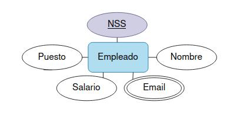
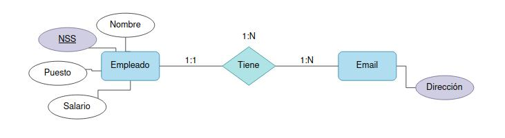
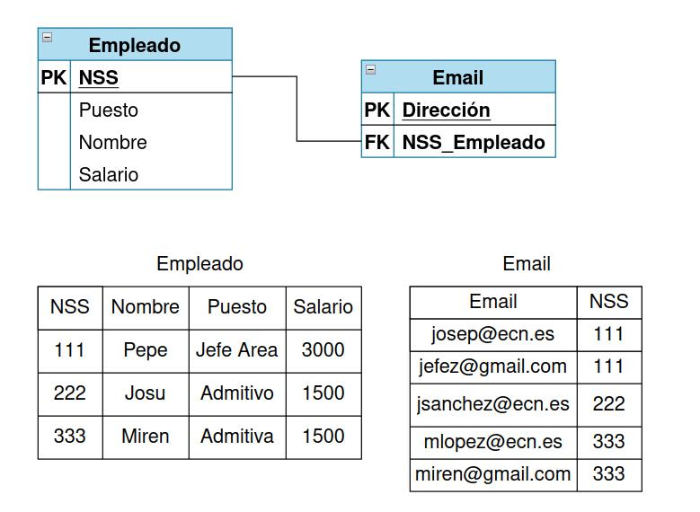
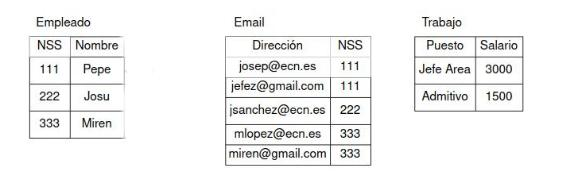

# Gestión de INEM
Tenemos una empresa publica donde los puestos de trabajo, están regulados por el estado, de modo que las condiciones salariales están determinadas por el puesto de trabajo.

- 1 Indicar claves candidatas.
    En un principio la clave candidata principal es el **número de la seguridad social**, aunque email tiene posibilidad de serla al ser un atributo multivaluado

- 2 Comprobar si se cumple la 1ª Forma Normal, normalizar si no.
    
La primera forma normal no se cumple ya que los atributos no son atómicos, por lo que hay que normalizar

  

- 3 Comprobar si se cumple la 2ª Forma Normal, normalizar si no.

La segunda forma normal no se cumple ya que aún hay elementos en la tabla que no se relacionan directamente con una clave primaria

  

- 4 Comprobar si se cumple la 3ª Forma Normal, normalizar si no.

La tercera forma normal se cumple ya que no hay dependencias transitivas.

- 5 Generar el **[Diagrama E/R resultante](#id1)**

