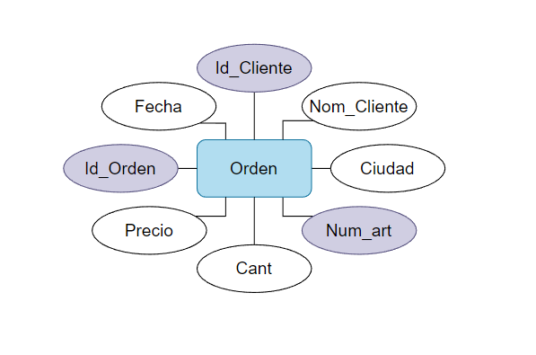
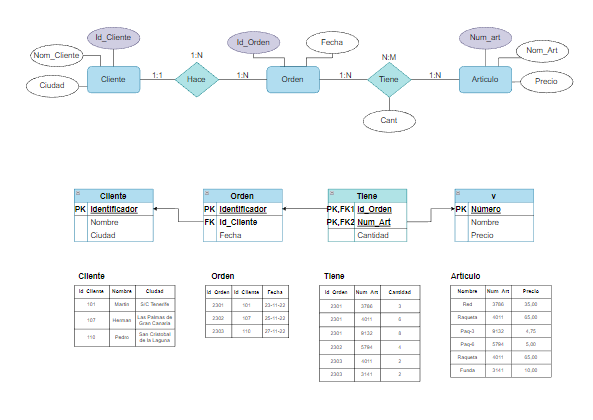

# Pedidos
Tenemos una empresa de pedidos que tiene como objetivo la gestión de la información de sus compras.

La representación de la información dentro de la BBDD es la siguiente:

**orden (id_orden, fecha, id_cliente, nom_cliente, ciudad, num_art, nom_art, cant, precio)**

- 1 Indicar las claves candidatas

Tal como se muestra en la imagen, las claves son los identificadores tanto de cliente como de orden y el número del producto enviado.

- 2 Comprobar si se cumple la 1ª Forma Normal, normalizar si no.
    
La primera forma normal no se cumple ya que los atributos no son atómicos por lo que hay que normalizar, resultando en los diagramas de la siguiente imagen.

- 3 Comprobar si se cumple la 2ª y la 3ª forma normal

Las formas normales se cumplen ya que todos los elementos en la tabla se relacionan directamente con una clave primaria y no hay dependencias transitivas

